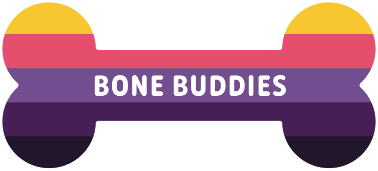
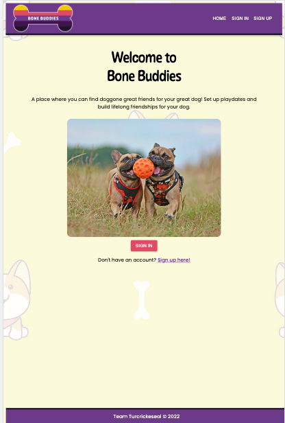

## Table of Contents
- [Table of Contents](#table-of-contents)
- [Description](#description)
- [Links](#links)
  - [User Story](#user-story)
  - [Acceptance Criteria](#acceptance-criteria)
- [What We Learned](#what-we-learned)
- [Resources](#resources)
  - [Authors](#authors)
  - [Andrew Yeh](#andrew-yeh)
  - [Angie Soto](#angie-soto)
  - [Asha Chakre](#asha-chakre)
  - [Ivy Chang](#ivy-chang)
  - [Nolan Spence](#nolan-spence)
- [Built With](#built-with)
- [License](#license)
## Description

Arrrrf you found us!  Bone Buddies is the ultimate web application to discover and interact with other dog lovers emphasizing the importance of finding the ideal dog playmate for your dog.  Our site will easily guide you through the process of creating an account and then setting up your dog's profile.  And because we love dogs so much... of course!  You can make as many dog profile per account as you need since we all now you can't have too many.  We took a unique approach in keeping the application experience dog-centric in order to quickly assess the compatibility of possible dog-mates so that no time is wasted on social niceties with other humans until you find the dog match that was made in heaven.  From there, the owners can take over and communicate via chat to make plans for Rover and Fido to romp through some ocean waves or chase their favorite ball.

Bone Buddies is a MERN stack application integrated with an Apollo server.  This provides the flexibility to quickly innovate and improve the user experience; the team has plans to grow the functionality and features to keep humans and canines happy and thriving.  Apollo subscriptions were chosen to deliver responsive websocket features so you will never miss a message or moment with live data automatically coming to life on the screen.  Cloudinary hosts any uploaded profile pictures so that you can rely on easily adding your favorite friend's adorable, clumsy, and impressive moments to attract the perfect playmate.

## Links
[Solution URL](https://github.com/Unicorn-Barf/Doggy_Dating)<br>
[Deploy URL](https://bonebuddies.onrender.com)

***The following images show the web application's appearance and functionality in large screen***

https://user-images.githubusercontent.com/101746882/194732918-7086674a-3c60-4869-855b-27d6f8f2de26.mp4

***The following images show the web application's appearance and functionality shows responsiveness small screens***


### User Story

```md
AS A PERSON with pet dogs,
I WANT my dog to find other cute dogs to playdate with,
SO THAT I can watch my dog socialize hapily and find new doggy friends.
```
### Acceptance Criteria

```md
GIVEN a social network of social dogs
WHEN I load the application
THEN I am presented with a landing page with the options to Signin/Signup
WHEN I click on the Signin button
THEN I am presented with a form to enter my login information and a submit button
WHEN I don't have an account yet
THEN I can choose to sign up and create an account using an intuitive form
WHEN I click on the Login/Signup forms submit button
THEN I am taken to the appropriate homepage or create dog profile form if I don't have a dog entered in the database
WHEN I scroll the available dogs on the homescreen
THEN I am presented with abbreviated profile cards with the other dog's profile picture, and basic information
WHEN I click on a dog profile card
THEN I am taken to an in depth profile page with more information about that dog and includes a playdate button
WHEN I click on the playdate button,
THEN I am taken to a chat screen where I can communicate with the other owner
WHEN I click the back to chats button
THEN I am taken to a chats screen where I can see all my active chats with basic information on each chat card
WHEN I click on a chat card
THEN once again an individual messaging screen is shown where I can message a particular dog
WHEN I need to change my user settings
THEN I click the option on the navbar for owner settings and can modify my information using the provided form
WHEN need to change my dog's profile
THEN I click the option on the navbar for dog settings and can modify my dog's information using a form and upload additional images
WHEN I wish to create another dog profile for a different dog
THEN I click on the create dog option in the navbar and fill out the provided form and a dog is added
WHEN I need to change between my saved dogs
THEN I use the navbar option to toggle between dog profiles
WHEN I click on the Logout button
THEN I am logged out and the navbar now only shows options for home, signin, and signup
```



## What We Learned

This was the first time that this team implemented websockets using Apollo subscriptions to get live date shared between users.  There are some notable differences beween using Apollo subscriptions vs other options such as SocketIO.  One thing to note, Apollo docs show a setup for a websocket client being served with a `ws://` protocol.  With SocketIO the default protocol is over https and wss; the problem that arises is that deployment on Heroku becomes an issue.  We found a simple solution shown below to set up your `wsLink` in the main index.js of a npx `create-react-app`.  Using this setup, it not only get around the issue of the `wss` protocol for production, but and sets the appropriate development websocket link.


```js
// Apollo Subscriptions setup
let wsLink;
// eslint-disable-next-line no-restricted-globals
if (/herokuapp/g.test(location.host)) {
    wsLink = new GraphQLWsLink(createClient({
        // eslint-disable-next-line no-restricted-globals
        url: `wss://${location.host}/graphql`,
      }));
} else {
    wsLink = new GraphQLWsLink(createClient({
        url: `ws://localhost:3001/graphql`,
      }));
}
```

The next thing that one needs to keep in mind when setting up for utilizing subscriptions, keep in mind the difference between the apollo hooks, `useQuery()` and `useSubscription()`.  We found the best strategy for our application was to use `useQuery()` because if you check documentation, there is a way to query and attach a subscription to dynamically update that query data through websockets as the database get hit and triggers different PubSub events.  Below is an example of how to `.subscribeToMore()` on an existing query:

```js
  const convoQuery = useQuery(GET_CONVERSATION_BY_ID,
    { variables: { conversationId } });

  // Handle subscription for messages
  convoQuery.subscribeToMore({
    document: GET_MESSAGES_SUB,
    variables: { conversationId },
    updateQuery: (prev, { subscriptionData }) => {
      if (!subscriptionData.data) return prev;
      const messages = subscriptionData.data.messageSent.messages;
      return {
        getConversationById: [...messages],
      };
    }
  });
```

As seen above, `subscribeToMore()` is a function that belongs to the return object from `useQuery()` that can configure how to handle subscriptions related to the data that you querried for.  The data structures you query for and pass to update have some specific constraints to be wary of, read the Apollo docs carefully because they accurrately explain if.  If you have data structures set up incorrectly, the errors are not very descriptive and can be very hard to trace.  One of the most interesting parts of the `.subscribeToMore()` is the `updateQuery()` hook that handles how to update the user's data depending on what subscription data is returned from the websocket subscription.  Once again, follow docs carefully so you can guarantee it is the correct structure.

On the backend, behind the scenes, there are events and listeners on the server level to appropriately direct traffic and manage which clients get what data.  A fun but necessary feature we implemented on the backend was filtering on pubsub events.  Below shows what a serverside subscription resolver looks like in our case handling a new message sent event:

```js
messageSent: {
      subscribe: withFilter(
         () => pubsub.asyncIterator(['NEW_MESSAGE']),
         (payload, variables) => {
            // Only push update for relevent Dogs
            return (payload.messageSent._id.toString() === variables.conversationId);
         }
      )
   },
   ```

   As you can see, we can use the `withFilter()` to help decide which clients get send the data.  This function takes a normal event asyncIterator from pubsub, and a callback function that should return `true` to send the data or `false` it data shouldn't be sent to the subscriber.  We simply checked the subscriber's converstaion id against the `NEW_MESSAGE` event's conversation id to route to the appropriate users.

This project provides a great simple template to see how you can implement Apollo Subscriptions on a MERN stack to create a simple chat app.  We are excited to refine the usage while weaving in new features to breath life into the UX.
## Resources

- [DevThoughts App](https://github.com/victoria-lo/devthoughts/blob/master/client/src/App.js) - This Github repo was a great resource to quickly model our chat component as well as as helpful reference for Apollo subscription implementation.
- [Dog Data API](https://dog.ceo/dog-api/documentation/) - This is a free dog data API that we used to seed our database, easy to use for our pictures and breed options.
- [SO - Hashing Passwords on Update](https://stackoverflow.com/questions/40264754/hashing-password-on-update-with-mongoose) - This Stackoverflow post is a great reference in case you forget how to hash your passwords on database update requests.
- [Dog Personalities](https://www.fl-k9.com/dog-personalities) - We based our dog personalities selection off of this article.
- [SO - createSlice or createReducer](https://stackoverflow.com/questions/66307302/react-redux-createslice-or-createreducer) - Very insightful Stackoverflow question about Redux Tool Kit's createSlice and createReducer utilities.
- [Setup React Router With Material UI Navbar](https://youtu.be/vgoDeb1LY8c)
- [React Redux: Hooks](https://react-redux.js.org/api/hooks#usedispatch)
- [Stack Overflow: How do I implement a Logout functionality from a React -  Router Link to imports an array?](https://stackoverflow.com/questions/71504920/how-do-i-implement-a-logout-functionality-from-a-react-router-link-to-imports-an)
- [React Router: Navigate](https://reactrouter.com/en/v6.3.0/api#navigate)
- [MUI Core: Checkbox](https://mui.com/material-ui/react-checkbox/)
- [RapidTables: Hex to RGB Color Converter](https://www.rapidtables.com/convert/color/hex-to-rgb.html)
- [Dogs Have These 5 Major Personality Types](https://iheartdogs.com/dogs-have-these-5-major-personality-types/)


### Authors
### Andrew Yeh 
- Website - [Andrew Yeh](https://ayeh6.github.io/Yeh-Andrew-Portfolio-Website/)
- Github - [ayeh6](https://github.com/ayeh6)
### Angie Soto
- Website - [Angie Soto](https://anakela.github.io/react-portfolio/)
- Github - [anakela](https://github.com/anakela)
### Asha Chakre
- Website - [Asha Chakre](https://ashachakre0906.github.io/react-portfolio/)
- Github - [ashachakre0906](https://github.com/ashachakre0906)
### Ivy Chang
- Website - [Ivy Chang](https://howl-lab.github.io/Portfolio/)
- Github - [howl-lab](https://github.com/howl-lab)
### Nolan Spence
- Website - [Nolan Spence](https://unicorn-barf.github.io/Portfolio_Website_HTML_CSS/)
- Github - [Unicorn-Barf](https://github.com/Unicorn-Barf)
  
## Built With
<p align ="center">
    
    
    
    
    
    
    
    
    
    
    

</p>

## License
MIT License
Copyright (c) [2022] [Andrew yeh](https://github.com/ayeh6) [Angie Soto](https://github.com/anakela), [Asha Chakre](https://github.com/ashachakre0906), [Ivy Chang](https://github.com/howl-lab), [Nolan Spence](https://github.com/Unicorn-Barf)

Permission is hereby granted, free of charge, to any person obtaining a copy
of this software and associated documentation files (the "Software"), to deal
in the Software without restriction, including without limitation the rights
to use, copy, modify, merge, publish, distribute, sublicense, and/or sell
copies of the Software, and to permit persons to whom the Software is
furnished to do so, subject to the following conditions:
The above copyright notice and this permission notice shall be included in all
copies or substantial portions of the Software.
THE SOFTWARE IS PROVIDED "AS IS", WITHOUT WARRANTY OF ANY KIND, EXPRESS OR
IMPLIED, INCLUDING BUT NOT LIMITED TO THE WARRANTIES OF MERCHANTABILITY,
FITNESS FOR A PARTICULAR PURPOSE AND NONINFRINGEMENT. IN NO EVENT SHALL THE
AUTHORS OR COPYRIGHT HOLDERS BE LIABLE FOR ANY CLAIM, DAMAGES OR OTHER
LIABILITY, WHETHER IN AN ACTION OF CONTRACT, TORT OR OTHERWISE, ARISING FROM,
OUT OF OR IN CONNECTION WITH THE SOFTWARE OR THE USE OR OTHER DEALINGS IN THE
SOFTWARE.
